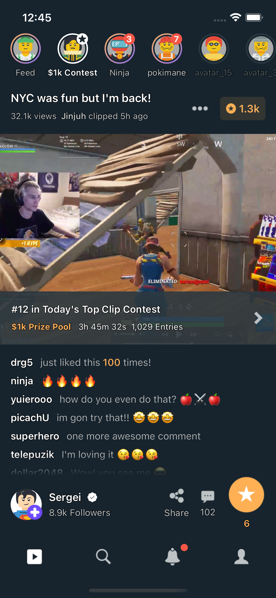
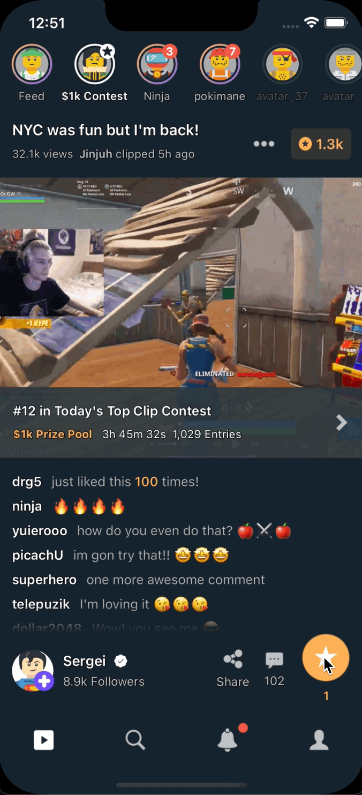

# Demo StreamApp.
###### Disclaimer: Yes. I know the code is not perfect. There are many things to discuss ;)
It is just a pet project to give an example of my **objective-c** knowledge and coding style at some point in my life.

### This app presents mocked data to provide the following UI:
- CollectionView.
- TableView.
- GradientView.
- Labels with outlined fonts.
- Core Animation.


